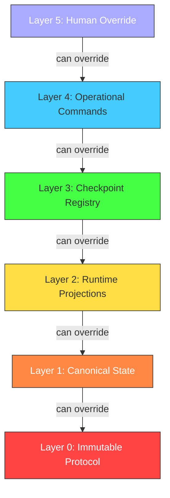

# Authority Hierarchy

> **Operational cognition document** — T30.2 deliverable  
> **Purpose:** Human-readable reference for governance authority layers and precedence rules.

## Overview

VINTRACK governance operates on a **6-layer authority stack**. Lower layers override higher layers in conflict resolution. Every governance decision can be traced to its authorizing layer.

## Authority Layers



### Layer 0: Immutable Protocol

| Aspect | Detail |
|--------|--------|
| **Source** | `meta/governance/protocols/*.json`, `meta/governance/schemas/*.json` |
| **Mutability** | Immutable (versioned replacement only) |
| **Authority** | Project charter / architectural committee |
| **Override** | None. Protocol changes require new version + migration. |

Examples:
- Event stream policy (`event-stream-policy.json`)
- Checkpoint schema (`checkpoint.schema.json`)
- Invariant definitions (`invariants.json`)

### Layer 1: Canonical State

| Aspect | Detail |
|--------|--------|
| **Source** | `meta/state/canonical-state.json` |
| **Mutability** | Mutable only through validated transitions |
| **Authority** | Current execution context + invariant gates |
| **Override** | Layer 0 protocols constrain valid transitions |

This is the **single mutable source of truth**. All other state is derived from this file.

### Layer 2: Runtime Projections

| Aspect | Detail |
|--------|--------|
| **Source** | `project-governance/runtime/projections/*.json`, `project-governance/runtime/state/*.json` |
| **Mutability** | Auto-generated; never hand-edited |
| **Authority** | Derived from Layer 1 via sync scripts |
| **Override** | Regenerated from Layer 1 on `projection:sync` |

Examples:
- `milestone-status.json`
- `enforcement-status.json`
- `active-execution.json`

### Layer 3: Checkpoint Registry

| Aspect | Detail |
|--------|--------|
| **Source** | `project-governance/runtime/checkpoints/*.json` |
| **Mutability** | Append-only |
| **Authority** | Execution state machine at transition time |
| **Override** | Checkpoints are immutable once written |

Checkpoints serve as **replay anchors**. They contain:
- `global_sequence` and `execution_sequence`
- `previous_checkpoint` reference
- Validation summary
- Topology snapshot (M30+)

### Layer 4: Operational Commands

| Aspect | Detail |
|--------|--------|
| **Source** | `scripts/*.ts`, CLI commands, agent directives |
| **Mutability** | Mutable through code changes (governed by TDD) |
| **Authority** | Agent execution context + lock ownership |
| **Override** | Blocked by invariant failures (Layer 0/1/2/3) |

Examples:
- `scripts/execution-state.ts transition`
- `scripts/emit-governance-event.ts`
- `scripts/enforce-governance.ts`

### Layer 5: Human Override

| Aspect | Detail |
|--------|--------|
| **Source** | Human operator decisions |
| **Mutability** | N/A |
| **Authority** | Final escalation path |
| **Override** | Can override any layer, but must emit audit event |

Human overrides are **always logged** and require explicit justification. They break automatic replay determinism and must be documented in the event stream.

## Conflict Resolution

When two authorities conflict, the **lower layer wins**:

```
Layer 0 > Layer 1 > Layer 2 > Layer 3 > Layer 4 > Layer 5
```

Wait — that's backwards from typical hierarchies. In VINTRACK, **Layer 0 is the most authoritative** because it represents immutable protocol. Layer 5 (human override) is the least authoritative in the normal case, though it is the final escalation.

### Example Conflict Resolution

| Conflict | Resolution |
|----------|------------|
| Human wants to skip invariant check | Blocked by Layer 0 (protocol requires invariants) |
| Projection disagrees with canonical state | Projection is regenerated from Layer 1 |
| Bootstrap has stale milestone | Updated from Layer 1 on sync |
| Checkpoint references nonexistent event | Replay validation fails (Layer 0 protocol) |

## Operational Notes

- **No layer can violate Layer 0.** Any attempt is classified as a CRITICAL drift.
- **Layer 1 mutations must pass all gates.** See `enforcement-flow.md` for gate details.
- **Layer 2 is disposable.** If corrupted, run `npm run projection:sync` to regenerate.
- **Layer 3 is append-only.** Never delete or modify a checkpoint file.
- **Layer 4 commands are ticket-driven.** No script runs without a valid ticket.
- **Layer 5 overrides require post-hoc justification.** Emit `governance.human_override` event.

## Querying Authority

```bash
# Find which layer owns a domain
npm run governance:query authority <component>

# Example:
npm run governance:query authority canonical-state
# → layer_1 (canonical_state)
```
