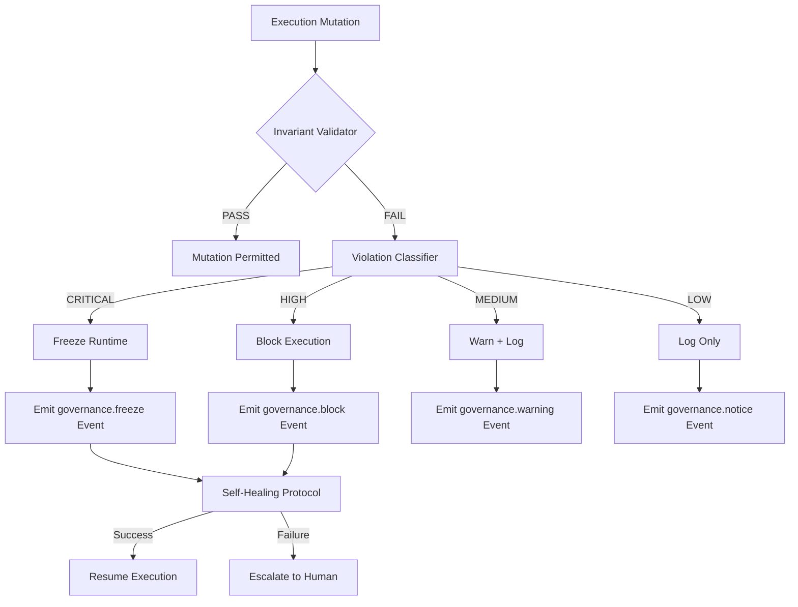

# Enforcement Flow

> **Operational cognition document** — T30.2 deliverable  
> **Purpose:** Human-readable reference for invariant enforcement, violation detection, and remediation.

## Overview

The enforcement layer ensures that **39 canonical invariants** remain satisfied at all times. When an invariant is violated, the system follows a strict escalation protocol: detect → classify → block → report → heal.

## Enforcement Architecture



## Invariant Severity Levels

| Severity | Count | Action on Violation | Example |
|----------|-------|---------------------|---------|
| **CRITICAL** | 22 | Immediate runtime freeze | Causality break, replay corruption |
| **HIGH** | 14 | Block current execution | Projection drift, bootstrap mismatch |
| **MEDIUM** | 9 | Warn + require acknowledgment | Benchmark regression, sequence gap |
| **LOW** | — | Log for audit | Minor telemetry drift |

## Enforcement Gates

The following gates are evaluated before any state transition:

1. **Bootstrap Gate:** `validate-bootstrap.ts` — canonical-state vs. runtime-bootstrap alignment
2. **Invariant Gate:** `validate-invariants.ts` — all 39 invariants
3. **Causality Gate:** `validate-causality.ts` — event lineage integrity
4. **Replay Gate:** `validate-replay-integrity.ts` — deterministic replay
5. **Projection Gate:** `validate-projections.ts` — derived state consistency
6. **Benchmark Gate:** `validate-benchmark.ts` — performance regression
7. **Hygiene Gate:** `validate-repository-hygiene.ts` — repository cleanliness

## Operational Procedures

### Running Enforcement Checks

```bash
# Full enforcement suite
npm run enforce:check

# Individual gates
npm run invariant:validate
npm run causality:validate
npm run replay:validate
npm run projection:validate
npm run bootstrap:validate
npm run benchmark:validate
npm run hygiene:validate
```

### Responding to a CRITICAL Violation

1. **Runtime automatically transitions to `FROZEN`.**
2. **Emit freeze event:** `npm run governance:event:emit governance.freeze critical governance '{"reason":"invariant_violation"}'`
3. **Inspect findings:** Run `npm run diagnostics:run` for full context.
4. **Identify root cause:** Check `meta/governance/events/streams/validation.ndjson`.
5. **Remediate:** Fix the underlying issue (code, state, or configuration).
6. **Re-validate:** Run all gates until clean.
7. **Emit unfreeze event:** `npm run governance:event:emit governance.unfreeze info governance '{"reason":"remediation_complete"}'`
8. **Resume execution:** Transition from `FROZEN` to `IDLE`.

### Responding to a HIGH Violation

1. **Current execution is blocked.** Lock remains held.
2. **Inspect the failing gate** for specific error messages.
3. **Fix the issue** (e.g., sync projections, update bootstrap).
4. **Re-run the specific gate** until it passes.
5. **Execution resumes** automatically if the block was gate-based.

### Self-Healing Protocol

```bash
# Scan for drift
npm run heal:scan

# Run auto-healing
npm run heal:run

# Create snapshot before healing
npm run heal:snapshot
```

The self-healing protocol can automatically repair:
- Projection drift (resync from canonical state)
- Stale locks (release expired locks)
- Missing bootstrap fields (rebuild from canonical state)

It **cannot** repair:
- Causality breaks (requires manual audit)
- Replay corruption (requires event stream surgery)
- Invariant logic errors (requires code change)

## Incident Response Quick Reference

| Gate | Failure Mode | Severity | Immediate Action |
|------|-------------|----------|------------------|
| `invariant:validate` | Invariant failure | CRITICAL/HIGH | Run `npm run diagnostics:run` |
| `causality:validate` | Lineage break | CRITICAL | Halt, inspect event streams |
| `replay:validate` | Gap/orphan | MEDIUM | Document gap, verify intent |
| `projection:validate` | Drift | HIGH | Run `npm run projection:sync` |
| `bootstrap:validate` | State mismatch | HIGH | Sync canonical-state → bootstrap |
| `benchmark:validate` | Regression | MEDIUM/WARN | Review commit range |
| `hygiene:validate` | Dirty worktree | HIGH | Commit or stash changes |
