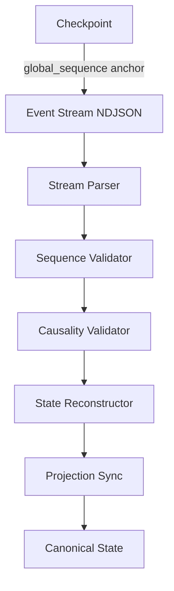

# Replay Flow

> **Operational cognition document** — T30.2 deliverable  
> **Purpose:** Human-readable reference for event stream replay and trust frontier semantics.

## Overview

The VINTRACK governance runtime is **fully replay-deterministic**. Any state can be reconstructed by replaying events from a known checkpoint forward. This document explains how replay works, what the trust frontier is, and how to reason about lineage.

## Replay Architecture



## The Genesis Boundary

The **Genesis Boundary** (`c1238e09-ac95-4626-a5fe-181a49d23ca2`, sequence 6) is the formal trust frontier. All events at or after this boundary are **normalized** and replay-deterministic.

### Pre-Boundary Events (Legacy Frontier)

| Event ID | Sequence | Classification |
|----------|----------|----------------|
| `04f62734-6831-4392-b364-bde1e049882c` | 1 | Pre-normalization |
| `37d23d94-31db-4365-b243-ea5b36beb436` | 2 | Pre-normalization |

These events exist in lineage but are **exempt from strict causality validation**. They are classified as `legacy_frontier` ancestors.

### Post-Boundary Events

All events from sequence 6 onward must satisfy:

- **Monotonic sequences:** No duplicate or out-of-order `global_sequence` values
- **Parent existence:** Every `parent_event_id` must resolve to an existing event
- **Acyclic lineage:** No event may be its own ancestor (directly or transitively)
- **Clock sanity:** `timestamp` must not exceed wall-clock time by more than 5 minutes
- **Stream completeness:** Every sequence number must appear in at least one stream

## Replay Modes

### 1. Deterministic After Boundary (Default)

```bash
npm run replay:validate
```

- Validates all events from sequence 6 onward
- Ignores pre-boundary lineage gaps
- Full causality, ordering, and completeness checks

### 2. Legacy Replay (Research / Audit)

Used only for historical audit. Does not guarantee determinism.

### 3. Checkpoint-Anchored Replay

```bash
npm run replay:run -- --from-checkpoint <checkpoint_id>
```

- Replays from a specific checkpoint's `global_sequence`
- Used for recovery after failure
- Guarantees deterministic state reconstruction

## Event Streams

| Stream | Purpose | Events |
|--------|---------|--------|
| `default.ndjson` | General governance events | state transitions, milestone progress |
| `validation.ndjson` | Validation results | invariant reports, causality checks |
| `diagnostics.ndjson` | Health and telemetry | heartbeats, drift reports |
| `execution.ndjson` | Execution lifecycle | lock acquire/release, recipe execution |

## Operational Procedures

### Validating Replay Integrity

```bash
# Full replay validation
npm run replay:validate

# Expected output:
# Events inspected: N
# Streams inspected: 4
# Checkpoints inspected: 20
# Findings: 0 (or MEDIUM findings documented)
```

### Recovering from Replay Failure

1. **Identify the gap:** The validator reports missing sequence numbers.
2. **Check stream corruption:** Inspect NDJSON files for truncation or corruption.
3. **Re-emit missing events:** If events were lost, re-emit with explicit `parent_event_id` linkage.
4. **Re-validate:** Run `npm run replay:validate` until clean.
5. **Emit recovery checkpoint:** Mark the recovery point with `npm run replay:run -- --checkpoint`.

### Trust Frontier Verification

```bash
# Verify the genesis boundary is intact
grep "c1238e09-ac95-4626-a5fe-181a49d23ca2" project-governance/runtime/events/streams/*.ndjson
```

The boundary event must exist in at least one stream with `global_sequence: 6`.

## Invariant Mapping

| Invariant | Code | Description |
|-----------|------|-------------|
| Ancestor Traversability | RI-001 | Every ancestor must be resolvable |
| Duplicate Global Sequence | RI-002 | No duplicate `global_sequence` across streams |
| Orphaned Events | RI-003 | Every event must have a reachable root |
| Duplicate Lineage | RI-004 | No event may claim two different parents |
| Future Timestamps | RI-005 | No event timestamp in the future |
| Sequence Gaps | RI-006 | Gaps must be documented and justified |
| Checkpoint Anchor | RI-007 | Latest checkpoint must match event stream tail |
