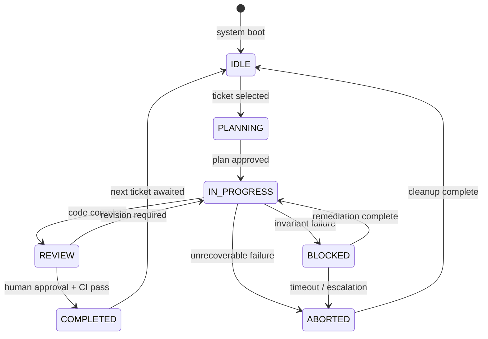

# Runtime Lifecycle

> **Operational cognition document** — T30.2 deliverable  
> **Purpose:** Human-readable reference for the 9-state execution lifecycle.

## Overview

The VINTRACK governance runtime operates as a deterministic state machine with **9 canonical states**. Every execution transitions through these states under explicit protocol control. No implicit state changes are permitted.

## State Machine

## States

| State | Code | Description | Entry Guard | Exit Guard |
|-------|------|-------------|-------------|------------|
| **IDLE** | `idle` | No active execution. Awaiting ticket selection. | System boot or milestone closure | Valid ticket exists |
| **PLANNING** | `planning` | Ticket selected, implementation plan being drafted. | Lock acquired | Plan approved or aborted |
| **IN_PROGRESS** | `in_progress` | Active implementation. Code changes in flight. | Plan approved | Code complete or blocked |
| **REVIEW** | `review` | Code complete, awaiting human review and CI validation. | All acceptance criteria met | CI pass + human approval |
| **COMPLETED** | `completed` | Ticket finished, lock released, state reset to IDLE. | Review approved | Automatic → IDLE |
| **BLOCKED** | `blocked` | Execution halted by invariant failure, drift, or dependency. | Invariant violation detected | Remediation verified |
| **ABORTED** | `aborted` | Execution terminated without completion. Cleanup required. | Unrecoverable failure | Cleanup complete |
| **HEALING** | `healing` | Self-healing protocol active (auto-remediation). | Drift detected | Drift repaired or escalated |
| **FROZEN** | `frozen` | Emergency freeze. All mutations halted. | Critical security/replay failure | Manual unfreeze + audit |

## Valid Transitions

Only the following transitions are permitted:

1. `IDLE → PLANNING`
2. `PLANNING → IN_PROGRESS`
3. `IN_PROGRESS → REVIEW`
4. `REVIEW → COMPLETED`
5. `REVIEW → IN_PROGRESS`
6. `IN_PROGRESS → BLOCKED`
7. `BLOCKED → IN_PROGRESS`
8. `IN_PROGRESS → ABORTED`
9. `BLOCKED → ABORTED`
10. `ABORTED → IDLE`
11. `COMPLETED → IDLE`
12. `* → HEALING` (from any state on drift detection)
13. `HEALING → IN_PROGRESS` (on success)
14. `HEALING → BLOCKED` (on failure)
15. `* → FROZEN` (emergency only)
16. `FROZEN → IDLE` (after manual audit)

## Operational Notes

- **Lock semantics:** A lock is acquired on `IDLE → PLANNING` and released on `COMPLETED → IDLE` or `ABORTED → IDLE`.
- **Checkpoint emission:** Checkpoints are emitted on every state transition except `HEALING` internal loops.
- **Causality:** Every transition emits a `governance.state_transition` event with `previous_state` and `new_state`.
- **Replay addressability:** The runtime can be reconstructed from any checkpoint by replaying events forward from that checkpoint's `global_sequence`.

## Incident Response Reference

| Symptom | Likely State | Action |
|---------|--------------|--------|
| No work progressing | `BLOCKED` | Run `npm run diagnostics:health` |
| CI failing repeatedly | `REVIEW → IN_PROGRESS` loop | Check `npm run invariant:validate` |
| Unknown state | Check `meta/state/canonical-state.json` | Validate bootstrap |
| Emergency required | Transition to `FROZEN` | Emit freeze event, halt all agents |
