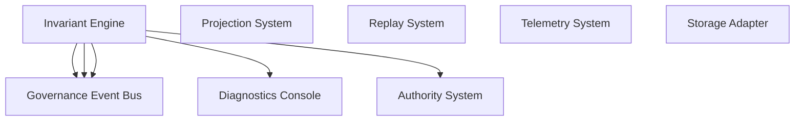

# Governance Subsystem Map

```mermaid
graph TD;
  governance_events["Governance Event Bus"]
  governance_invariants["Invariant Engine"]
  governance_projections["Projection System"]
  governance_replay["Replay System"]
  governance_telemetry["Telemetry System"]
  governance_storage["Storage Adapter"]
  governance_diagnostics["Diagnostics Console"]
  governance_authority["Authority System"]
  governance_invariants --> governance_events
  governance_invariants --> governance_diagnostics
  governance_invariants --> governance_events
  governance_invariants --> governance_events
  governance_invariants --> governance_authority
```
