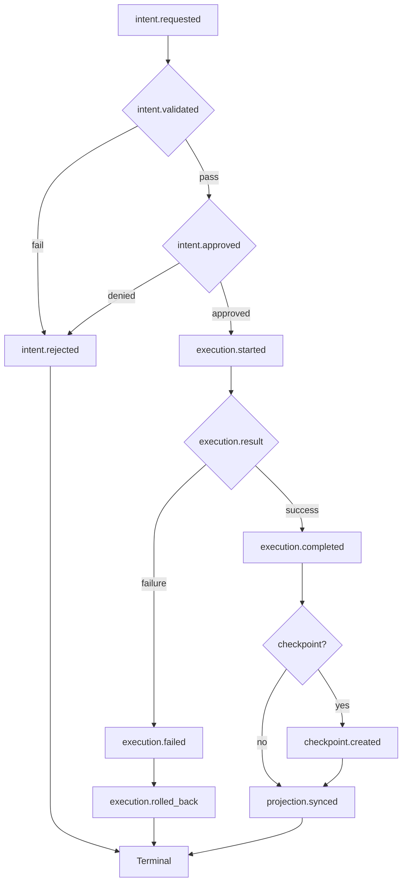

# Control Action Lifecycle

> **Operational cognition document** — T31.3a deliverable  
> **Purpose:** Human-readable reference for the formal control action execution lifecycle, intent immutability, approval chains, and correlation semantics.

## Overview

The VINTRACK control plane operates on a **10-stage execution lifecycle**. Every operational action transitions through these stages under explicit governance control. No action may skip stages or bypass approval gates.

## Execution Lifecycle



## Stage Definitions

### Stage 1: intent.requested

| Property | Value |
|----------|-------|
| **Emitted by** | Dashboard, CLI, API, Agent |
| **Immutable** | ✅ Yes |
| **Correlation anchor** | ✅ Yes |
| **Required fields** | `action_id`, `actor`, `intent` |

The intent event is the **single immutable record** of operator desire. It cannot be mutated, updated, or retracted. If the operator changes their mind, a new intent must be emitted with a new `action_id`.

**Example:**

```json
{
  "event_type": "intent.requested",
  "action_id": "ACT-2026-05-25-001",
  "actor": "operator",
  "intent": {
    "recipe_id": "healing_sync_projections",
    "target": "projection drift",
    "parameters": {},
    "reason": "projection drift detected after M31 closure"
  }
}
```

### Stage 2: intent.validated

| Property | Value |
|----------|-------|
| **Emitted by** | Guard layer |
| **Immutable** | ✅ Yes |
| **Required fields** | `action_id`, `validation` |

The guard layer checks:
- Invariant compliance
- Recipe capability constraints
- Current lock state
- Authority boundaries

If validation fails, the flow terminates at `intent.rejected`.

### Stage 3: intent.approved / intent.rejected

| Property | Value |
|----------|-------|
| **Emitted by** | Approval layer |
| **Immutable** | ✅ Yes |
| **Required fields** | `action_id`, `approval` |

Approval semantics:

| Action Class | Mode | Min Approvers | Roles |
|--------------|------|---------------|-------|
| observational | auto | 0 | — |
| administrative | auto | 0 | — |
| enforcement | auto | 0 | — |
| recovery | human | 1 | governance_operator |
| destructive | human | 1 | governance_operator |
| orchestration | human | 1 | governance_operator |

### Stage 4: execution.started

| Property | Value |
|----------|-------|
| **Emitted by** | Orchestration layer |
| **Required fields** | `action_id`, `intent` |

The orchestration layer invokes the recipe. This stage also emits `control.recipe.invoked`.

### Stage 5: execution.completed / execution.failed

| Property | Value |
|----------|-------|
| **Emitted by** | Orchestration layer |
| **Required fields** | `action_id`, `outcome` |

Records success or failure. On failure, the flow proceeds to rollback.

### Stage 6: execution.rolled_back

| Property | Value |
|----------|-------|
| **Emitted by** | Orchestration layer |
| **Required fields** | `action_id`, `outcome` |
| **Terminal** | ✅ Yes |

Executes rollback steps defined in the recipe. If rollback also fails, the failure is logged but the chain terminates.

### Stage 7: checkpoint.created (conditional)

| Property | Value |
|----------|-------|
| **Emitted by** | Checkpoint layer |
| **Required fields** | `action_id`, `outcome.checkpoint_id` |
| **Conditional** | Only on successful execution |

Captures:
- Global sequence anchor
- Causality chain
- Replay boundary metadata
- Milestone/ticket context
- Git commit

### Stage 8: projection.synced (terminal)

| Property | Value |
|----------|-------|
| **Emitted by** | Projection layer |
| **Required fields** | `action_id` |
| **Terminal** | ✅ Yes |

Synchronizes all projections from canonical state.

## Correlation Semantics

Every event in an execution chain shares the **same `action_id`**:

```
intent.requested     → action_id: ACT-001
intent.validated     → action_id: ACT-001
intent.approved      → action_id: ACT-001
execution.started    → action_id: ACT-001
execution.completed  → action_id: ACT-001
checkpoint.created   → action_id: ACT-001
projection.synced    → action_id: ACT-001
```

This enables:
- Full trace reconstruction
- Replay determinism
- Audit attribution
- Rollback boundary identification

## Action Classes

| Class | Mutation | Approval | Risk | Examples |
|-------|----------|----------|------|----------|
| **observational** | None | Auto | Low | health-check, suggest-next-actions |
| **administrative** | Metadata | Auto | Low | projection-sync, index-rebuild |
| **enforcement** | Validation only | Auto | Medium | validate-all |
| **recovery** | State repair | Human | High | sync-projections, self-heal-run |
| **destructive** | Irreversible | Human | Critical | state-reset, stream-purge |
| **orchestration** | Multi-step | Human | High | milestone-close |

## Intent Immutability Rule

> **Once `intent.requested` is emitted, it is forever immutable.**

Approvals, rejections, modifications, and cancellations must all produce **new events** with the same `action_id`. Never update the original intent.

**Correct:**
```json
// Original intent
{ "event_type": "intent.requested", "action_id": "ACT-001", ... }

// Approval as new event
{ "event_type": "intent.approved", "action_id": "ACT-001", ... }

// Rejection as new event
{ "event_type": "intent.rejected", "action_id": "ACT-001", ... }
```

**Incorrect:**
```json
// NEVER DO THIS
{ "event_type": "intent.requested", "action_id": "ACT-001", "status": "approved" }
```

## Checkpoint Semantics

Checkpoints are created **conditionally** after successful execution. They are not created on:
- Rejected intents
- Failed executions
- Rollback completions
- Observational actions

A checkpoint contains:
- `global_sequence` — replay anchor
- `execution_sequence` — execution-scoped anchor
- `previous_checkpoint` — lineage reference
- `causality` — parent event and chain
- `replay_boundary` — genesis boundary metadata
- `validation_summary` — gate statuses at checkpoint time
- `git_commit` — code state

## Operational Quick Reference

| If... | Then... |
|-------|---------|
| Intent validation fails | Emit `intent.rejected`; chain terminates |
| Approval timeout expires | Escalate; emit `intent.rejected` if unescalated |
| Execution fails | Emit `execution.failed`; attempt rollback |
| Rollback fails | Log failure; chain terminates; manual intervention required |
| Checkpoint creation fails | Log failure; chain continues; alert operator |
| Projection sync fails | Log failure; chain continues; alert operator |
